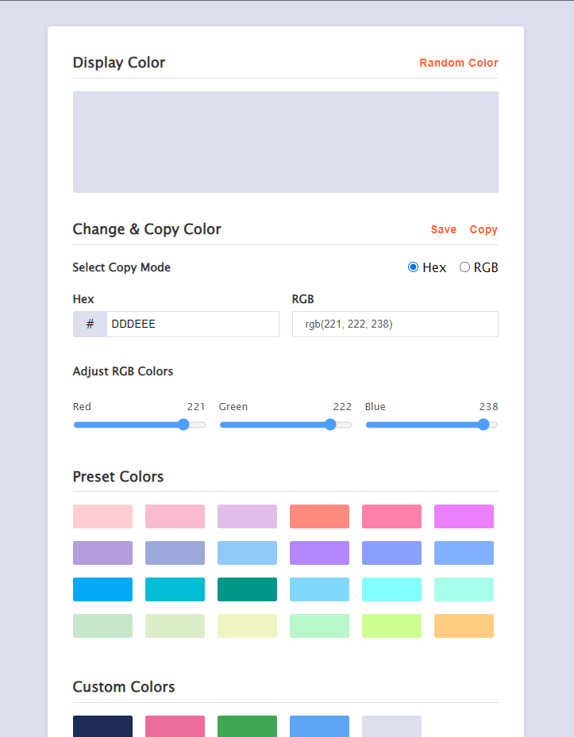

# Boost Your Base DOM Project

100% vanilla JavaScript code to design and functioning this cute little color picker application. No third party code has been used, well structured and easy to understand code syntax. This could be one of the great project to understand JavaScript and DOM workflow together.

[Live Demo](https://mrhm-dev.github.io/wb-color-picker/)

